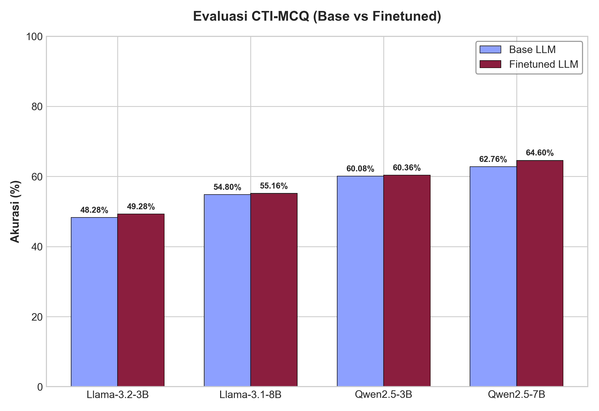
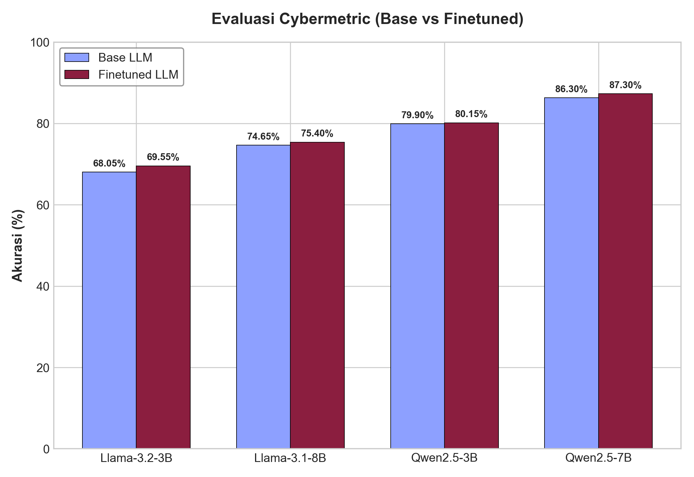
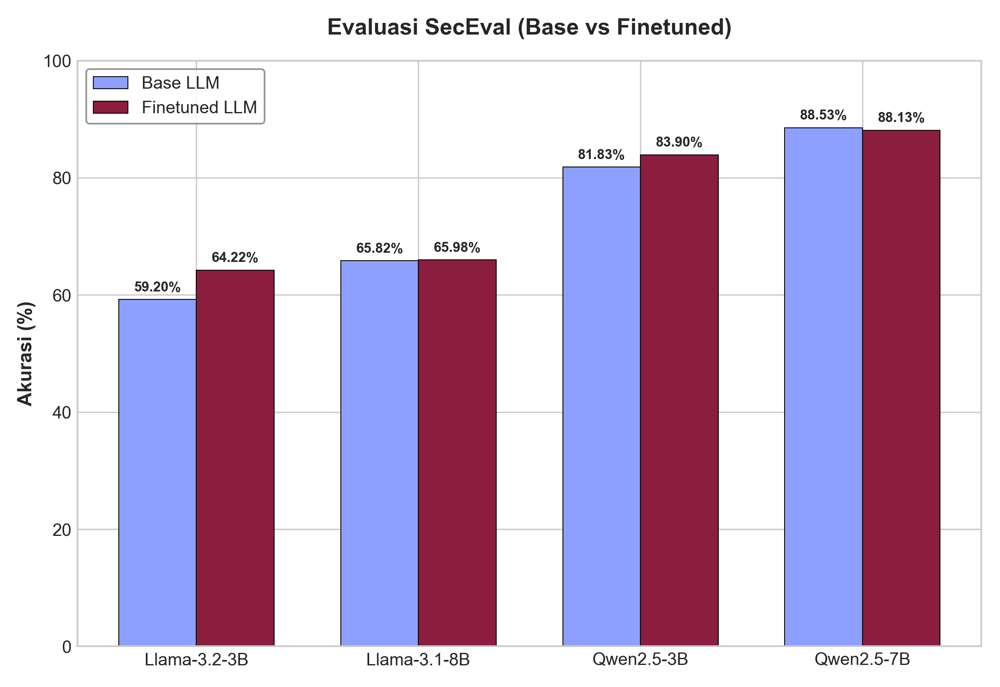

# Continued Pretraining LLM for Cyber Threat Intelligence (CTI)

This repository contains the code and resources for performing Continued Pretraining (CPT) on Large Language Models (LLMs) specifically tailored for Cyber Threat Intelligence (CTI) tasks. We utilize quantization and parameter-efficient fine-tuning techniques to efficiently train and evaluate models.

## Features

- **Unsloth Integration**: We use [Unsloth](https://github.com/unslothai/unsloth) to significantly speed up the training process and reduce VRAM usage through efficient 4-bit quantization and LoRA adapters. This allows us to train large models effectively even on limited hardware.
- **Automated Evaluation Pipelines**: Easy-to-use notebooks for evaluating base and fine-tuned models on specific CTI benchmarks.
- **Hugging Face Hub Support**: Seamless integration for pulling datasets and pushing trained models or adapters back to the Hugging Face Hub.

## Datasets

### 1. Training Dataset
We use the **Primus-Seed** dataset for continued pretraining to inject cybersecurity domain knowledge into the models.
- **Source**: [trendmicro-ailab/Primus-Seed](https://huggingface.co/datasets/trendmicro-ailab/Primus-Seed)
- **Scale**: Our cleaned subset of the training data holds approximately **42 million tokens**.

### 2. Evaluation Dataset
To benchmark the performance of our models, we use the **CTI-Bench MCQ** dataset. This dataset evaluates the model's cybersecurity knowledge through Multiple-Choice Questions (MCQ).
- **Source**: [AI4Sec/cti-bench (cti-mcq)](https://huggingface.co/datasets/AI4Sec/cti-bench/viewer/cti-mcq)

## Repository Structure

The core workflows are divided into the following Jupyter Notebooks:

- **`LLM_CPT.ipynb`**
  This notebook contains the code for training an LLM using a quantized model via Unsloth. It handles dataset preparation, model loading with 4-bit quantization, LoRA adapter configuration, the training loop, and uploading the finalized model/adapters to Hugging Face.

- **`MCQ_LLM_TEST.ipynb`**
  Used for performing the MCQ tests on the evaluation dataset. It loads models (both remote base models and local fine-tuned adapters), processes the `cti-mcq` prompts using greedy decoding, and generates predictions to calculate the model's accuracy.

- **`LLM_PERFORMANCE_EVAL.ipynb`**
  Used to compare the results of the LLM performance. It visualizes the evaluation metrics (e.g., correct answer percentages) across different models (Llama-3.2-3B, Llama-3.1-8B, Qwen2.5-3B, and Qwen2.5-7B - base vs. fine-tuned) using cleanly formatted plots.

- **`RESOURCE_USAGE.ipynb`**
  Monitors and visualizes the resource usage during the continued pretraining process by parsing the generated log files in the `logs/` directory.

## Setup and Requirements

The primary dependencies for this project are listed in `requirement.txt`. Key modules include:

- `torch`
- `transformers`
- `peft`
- `datasets`
- `huggingface_hub`
- `unsloth` & `bitsandbytes`

*(Note: Unsloth installation can be environment-specific; please refer to their [official documentation](https://github.com/unslothai/unsloth) for installation instructions depending on your setup/Colab).*

## Evaluation Results

To evaluate the impact of continued pretraining, we benchmarked the models on three datasets. Below are the comparison results of the Base models vs. their Finetuned counterparts.

### 1. CTI-MCQ Evaluation
Evaluating cybersecurity knowledge through multiple-choice questions (2,500 questions).

| Model | Base LLM | Finetuned LLM | Delta |
| :--- | :---: | :---: | :---: |
| **Llama-3.2-3B** | 48.28% | 49.28% | +1.00% |
| **Llama-3.1-8B** | 54.80% | 55.16% | +0.36% |
| **Qwen2.5-3B** | 60.08% | 60.36% | +0.28% |
| **Qwen2.5-7B** | 62.76% | 64.60% | +1.84% |

### 2. Cybermetric Evaluation
Evaluating standard cyber security domain metrics (2,000 questions).

| Model | Base LLM | Finetuned LLM | Delta |
| :--- | :---: | :---: | :---: |
| **Llama-3.2-3B** | 68.05% | 69.55% | +1.50% |
| **Llama-3.1-8B** | 74.65% | 75.40% | +0.75% |
| **Qwen2.5-3B** | 79.90% | 80.15% | +0.25% |
| **Qwen2.5-7B** | 86.30% | 87.30% | +1.00% |

### 3. SecEval Evaluation
Evaluating software, system, and web application security (1,255 questions, multi-ground truth evaluation using Jaccard index).

| Model | Base LLM | Finetuned LLM | Delta |
| :--- | :---: | :---: | :---: |
| **Llama-3.2-3B** | 59.20% | 64.22% | +5.02% |
| **Llama-3.1-8B** | 65.82% | 65.98% | +0.16% |
| **Qwen2.5-3B** | 81.83% | 83.90% | +2.07% |
| **Qwen2.5-7B** | 88.53% | 88.13% | -0.40% |

### Analysis & Discussion

- **Overall Improvement**: The finetuned models consistently demonstrate accuracy improvements (positive delta) across almost all benchmarks.
- **Why SecEval Performs "Less Worse" (Stable & High Improvement)**:
  - **Domain Alignment**: SecEval evaluates key areas of software and application security. These domains are heavily covered in the CTI knowledge injected via our **Primus-Seed** continued pretraining dataset, resulting in strong retention and positive transfer.
  - **Robustness of Base Capabilities**: Modern base models (especially Qwen2.5) are already pre-trained on massive corpora of code and computer science documentation, establishing a high baseline accuracy.
  - **Prompt and Format Alignment**: Since SecEval supports multiple ground truths per question, our integration of a specialized `SECEVAL_SYSTEM_PROMPT` and formatting parser ensured that the models did not suffer from decoding/formatting errors, allowing them to fully demonstrate their security knowledge.

